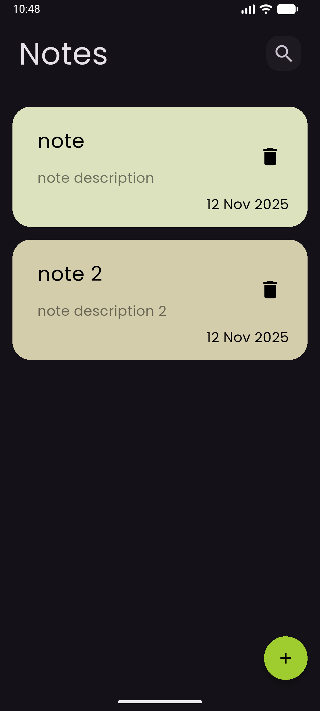
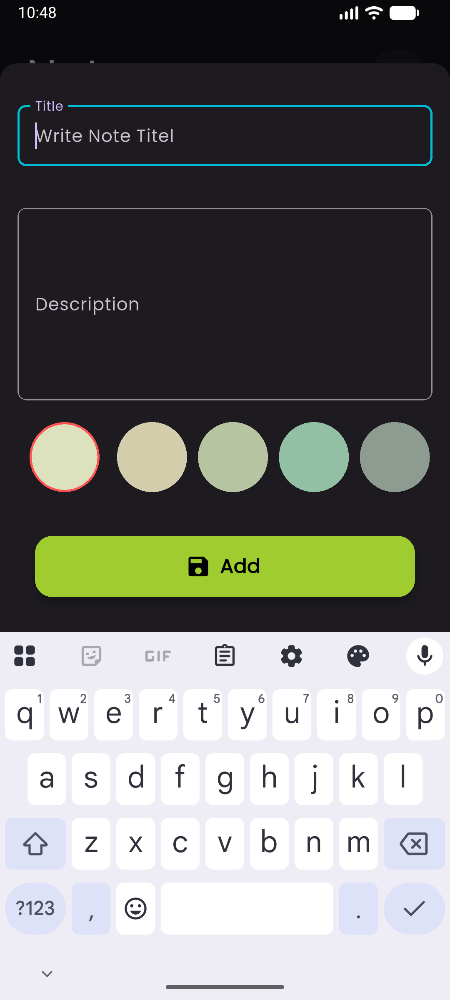
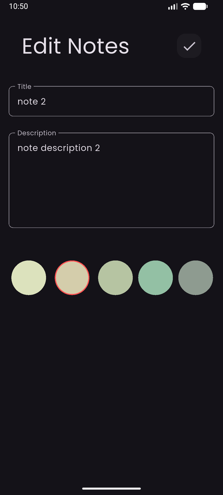
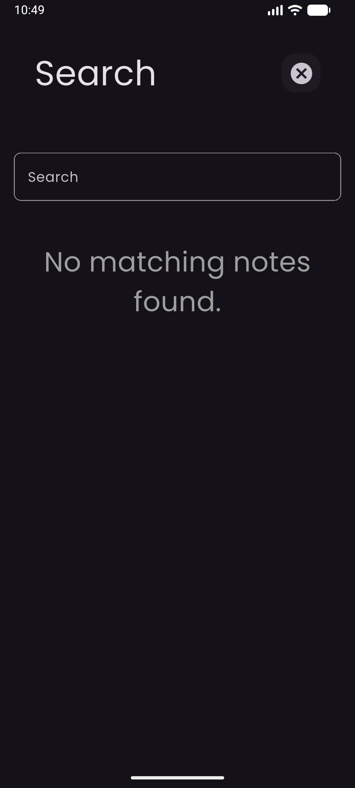
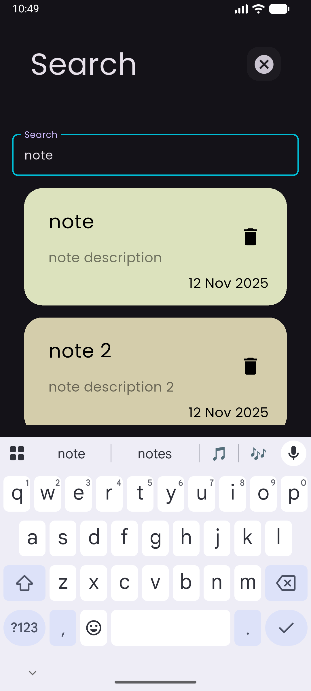

# 📝 Notes App - Flutter & Hive

A beautiful, feature-rich note-taking application built with Flutter and Hive database. Create, edit, search, and organize your notes with an elegant dark-themed interface and smooth animations.

[](https://flutter.dev/)
[](https://pub.dev/packages/hive)
[](https://pub.dev/packages/flutter_bloc)

---

## 📋 Table of Contents

- [Overview](#-overview)
- [Features](#-features)
- [Tech Stack](#-tech-stack)
- [Architecture](#-architecture)
- [Folder Structure](#-folder-structure)
- [Getting Started](#-getting-started)
- [How to Use](#-how-to-use)
- [Testing](#-testing)
- [Future Improvements](#-future-improvements)
- [Screenshots](#-screenshots)
- [Contributing](#-contributing)
- [License](#-license)
- [Connect With Me](#-connect-with-me)

---

## 🎯 Overview

**Notes App** is a modern, offline-first note-taking application that leverages the power of Hive database for blazing-fast local storage. Built with Flutter's BLoC pattern, it provides a seamless experience for creating, managing, and organizing your thoughts and ideas.

### Why This Project?

- **Offline-First**: All data is stored locally using Hive - no internet required
- **Fast & Lightweight**: Hive provides exceptional performance with minimal overhead
- **Clean Architecture**: Implements BLoC pattern for scalable state management
- **Beautiful UI**: Dark-themed interface with smooth animations and transitions
- **Cross-Platform**: Runs on Android, iOS, Web, Windows, macOS, and Linux

  

---

## ✨ Features

### Core Functionality

- ✅ **Create Notes** - Add notes with title and detailed descriptions
- ✏️ **Edit Notes** - Update your notes anytime with real-time saving
- 🗑️ **Delete Notes** - Remove notes you no longer need with confirmation
- 🔍 **Search Notes** - Fast, real-time search by note title
- 🎨 **Color Customization** - Choose from 5 beautiful preset colors for each note
- 💾 **Persistent Storage** - All notes saved locally with Hive database
- 🌙 **Dark Mode** - Eye-friendly dark theme throughout the app
- ⚡ **Instant Sync** - Changes reflect immediately across the app

### User Experience

- Smooth animations and transitions
- Material Design 3 components
- Responsive layout for all screen sizes
- Custom Poppins font for better readability
- Form validation for required fields
- Auto-save functionality
- Empty state messages for better UX

---

## 🛠️ Tech Stack

### Framework & Language
- **Flutter** `3.9.2+` - UI framework
- **Dart** - Programming language

### State Management
- **flutter_bloc** `7.0.0` - Business Logic Component pattern
- **bloc** - Core BLoC library

### Database
- **hive** `2.2.3` - Fast, lightweight NoSQL database
- **hive_flutter** `1.1.0` - Flutter extensions for Hive

### Code Generation
- **hive_generator** `2.0.1` - Generates type adapters
- **build_runner** `2.4.13` - Code generation tool

### Utilities
- **intl** `0.19.0` - Internationalization and date formatting
- **flutter_lints** `5.0.0` - Recommended lints for Flutter


---

## 🏗️ Architecture

This project follows **Clean Architecture** principles with **BLoC Pattern** for state management.

### Architecture Layers

```
┌─────────────────────────────────────┐
│         Presentation Layer          │
│  (Views, Widgets, UI Components)    │
└──────────────┬──────────────────────┘
               │
┌──────────────▼──────────────────────┐
│       Business Logic Layer          │
│    (Cubits, State Management)       │
└──────────────┬──────────────────────┘
               │
┌──────────────▼──────────────────────┐
│          Data Layer                 │
│   (Models, Hive Database)           │
└─────────────────────────────────────┘
```

### BLoC Pattern Implementation

**Cubits Used:**

1. **AddNoteCubit** - Manages note creation
   - States: `Initial`, `Loading`, `Success`, `Failure`
   - Handles form validation and data persistence

2. **NotesCubit** - Manages note retrieval and search
   - Fetches all notes from Hive
   - Implements real-time search functionality
   - Updates UI when notes change

### Data Flow

```
User Action → Widget → Cubit → Hive Database → State Update → UI Rebuild
```

---

## 📁 Folder Structure

```
notes_app_using_hive/
│
├── lib/
│   ├── main.dart                          # App entry point
│   ├── constants.dart                     # App-wide constants
│   │
│   ├── models/                            # Data models
│   │   ├── note_model.dart                # Note entity
│   │   └── note_model.g.dart              # Generated Hive adapter
│   │
│   ├── cubits/                            # Business logic
│   │   ├── add_note_cubit/
│   │   │   ├── add_note_cubit_cubit.dart
│   │   │   └── add_note_cubit_state.dart
│   │   └── notes_cubit/
│   │       ├── notes_cubit.dart
│   │       └── notes_state.dart
│   │
│   └── views/                             # UI screens
│       ├── home/
│       │   ├── home_view.dart
│       │   └── widgets/
│       │       ├── custom_appbar.dart
│       │       ├── custom_textfield.dart
│       │       ├── custom_search_icon.dart
│       │       ├── noteitem_widget.dart
│       │       ├── noteslistview_widget.dart
│       │       ├── notes_view_body.dart
│       │       ├── add_note_bottom_sheet.dart
│       │       ├── add_note_form.dart
│       │       └── colorslistview.dart
│       │
│       ├── editnote/
│       │   ├── edit_note_view.dart
│       │   └── widgets/
│       │       └── editnote_colorslistview.dart
│       │
│       └── search/
│           └── search_view.dart
│
├── assets/
│   └── fonts/
│       └── Poppins-Regular.ttf
│
├── pubspec.yaml                           # Dependencies
├── analysis_options.yaml                  # Linter rules
└── README.md                              # This file
```

---

## 🚀 Getting Started

### Prerequisites

Before you begin, ensure you have the following installed:

- [Flutter SDK](https://flutter.dev/docs/get-started/install) (3.9.2 or higher)
- [Dart SDK](https://dart.dev/get-dart) (included with Flutter)
- [Android Studio](https://developer.android.com/studio) or [VS Code](https://code.visualstudio.com/)
- [Git](https://git-scm.com/)

### Installation

1. **Clone the repository**

```bash
git clone https://github.com/Hossam-Yaser/NotesApp.git
cd NotesApp
```

2. **Install dependencies**

```bash
flutter pub get
```

3. **Generate Hive type adapters**

```bash
flutter packages pub run build_runner build --delete-conflicting-outputs
```

4. **Run the app**

```bash
flutter run
```

### Platform-Specific Setup

#### Android
- Minimum SDK: 21 (Android 5.0)
- Target SDK: 34 (Android 14)

#### iOS
- Minimum iOS version: 12.0
- Xcode 14+ required

#### Web
```bash
flutter run -d chrome
```

---

## 📱 How to Use

### Creating a New Note

1. Tap the **floating action button** (+ icon) at the bottom-right
2. Enter a **title** for your note (required)
3. Add a **description** (required)
4. **Select a color** from the available options
5. Tap the **"Add"** button to save

### Editing an Existing Note

1. Tap on any **note card** from the home screen
2. Modify the **title** or **description**
3. Change the **color** if desired
4. Tap the **checkmark icon** to save changes

### Deleting a Note

- Simply tap the **delete icon** (trash) on any note card
- The note will be removed immediately from storage

### Searching for Notes

1. Tap the **search icon** in the top-right corner
2. Type your search query in the text field
3. Results will appear in **real-time** as you type
4. Tap any result to view/edit the note
5. Tap the **cancel icon** to return to the home screen

### Customizing Note Colors

**Available Colors:**
- 🟢 Light Green (`#DCE2BD`)
- 🟡 Beige (`#D4CDAB`)
- 🌿 Sage Green (`#B6C4A2`)
- 🔵 Teal (`#93C0A4`)
- ⚫ Gray Green (`#8E9B90`)

---

## 🧪 Testing

### Running Tests

```bash
flutter test
```

### Test Coverage

```bash
flutter test --coverage
```

### Widget Testing

The project includes basic widget tests. To add more:

1. Create test files in the `test/` directory
2. Use `testWidgets()` for UI component tests
3. Use `blocTest()` for Cubit testing

**Example Test Structure:**

```dart
testWidgets('Add note button appears', (WidgetTester tester) async {
  await tester.pumpWidget(MyApp());
  expect(find.byType(FloatingActionButton), findsOneWidget);
});
```

---

## 🔮 Future Improvements

### Planned Features

- [ ] 📌 **Pin Important Notes** - Keep essential notes at the top
- [ ] 🏷️ **Tags & Categories** - Organize notes with custom tags
- [ ] 📎 **Attachments** - Add images and files to notes
- [ ] ☁️ **Cloud Sync** - Firebase integration for cross-device sync
- [ ] 🔒 **Password Protection** - Secure sensitive notes
- [ ] 📤 **Export/Import** - Backup notes as JSON/CSV
- [ ] 🎤 **Voice Notes** - Record audio notes
- [ ] ✅ **Checklist Support** - Create task lists within notes
- [ ] 🌈 **Custom Color Picker** - Choose any color for notes
- [ ] 🔔 **Reminders** - Set notifications for notes
- [ ] 📊 **Statistics** - Track note creation patterns
- [ ] 🌐 **Multi-language Support** - i18n implementation
- [ ] 🎨 **Theme Customization** - Light mode option
- [ ] 📱 **Widgets** - Home screen widgets for quick access
- [ ] 🔍 **Advanced Search** - Search by content, date, color

### Technical Improvements

- [ ] Unit tests for all Cubits
- [ ] Integration tests
- [ ] CI/CD pipeline setup
- [ ] Performance optimization
- [ ] Accessibility improvements
- [ ] Error handling enhancement
- [ ] Offline capability indicator

---

## 📸 Screenshots


<div align="center">

### Home Screen
   

*Beautiful dark-themed interface with note cards*

### Add Note



*Bottom sheet for creating new notes*

### Edit Note



*Full-screen editor with color picker*

### Search




*Real-time search functionality*

</div>

---

## 🤝 Contributing

Contributions are what make the open-source community amazing! Any contributions you make are **greatly appreciated**.

1. Fork the Project
2. Create your Feature Branch (`git checkout -b feature/AmazingFeature`)
3. Commit your Changes (`git commit -m 'Add some AmazingFeature'`)
4. Push to the Branch (`git push origin feature/AmazingFeature`)
5. Open a Pull Request

### Contribution Guidelines

- Follow the existing code style
- Write meaningful commit messages
- Add tests for new features
- Update documentation as needed
- Keep PRs focused and small

---

## 📄 License

Distributed under the MIT License. See `LICENSE` file for more information.

---

## 🌟 Show Your Support

If you found this project helpful, please give it a ⭐️!

---

## 👨‍💻 Connect With Me


**Hossam Yasser Abdelhady**  
📱 Cross-platform Mobile App Developer | Flutter | Dart  
💼 Passionate about creating modern, efficient, and user-friendly mobile applications.  

* 💼 [LinkedIn](https://www.linkedin.com/in/hossam-yasser-abdelhady/)
* 🐙 [GitHub](https://github.com/Hossam-Yaser)
* ✉️ Email: [hossamabdelhady000@gmail.com](hossamabdelhady000@gmail.com)
---

<div align="center">

**Made with ❤️ using Flutter**

If you have any questions or suggestions, feel free to reach out!

⭐️ Star this repo if you like it!

</div>
